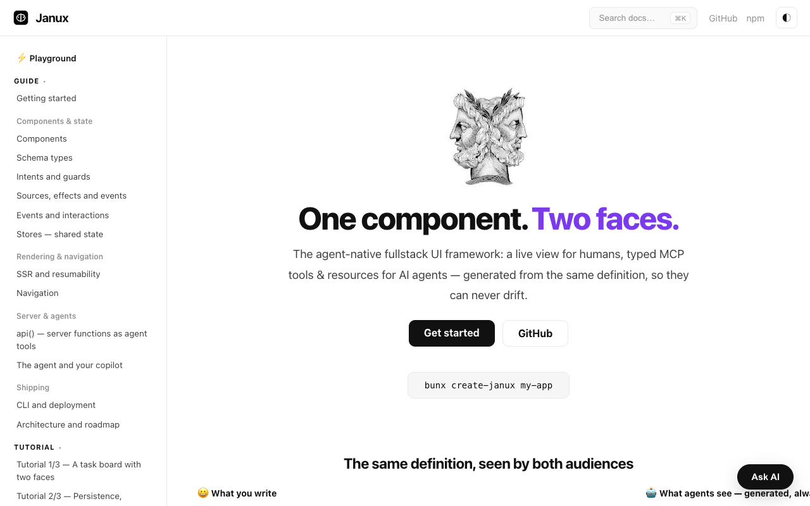

<p align="center">
  <picture>
    <source media="(prefers-color-scheme: dark)" srcset="docs/logo-dark.svg" />
    
  </picture>
</p>

<h1 align="center">Janux</h1>

<p align="center">
  <strong>The agent-native fullstack UI framework.</strong><br/>
  One component, two faces: a live view for humans, typed MCP tools &amp; resources for AI agents — generated from the same definition.
</p>

<p align="center">
  <a href="https://www.npmjs.com/package/janux"></a>
  <a href="https://www.npmjs.com/package/janux"></a>
  
  
  
  
  <a href="./LICENSE"></a>
</p>

---

Named after **Janus**, the two-faced Roman god of doorways: one face toward the human, one toward the agent, one threshold. Designed in [RFC 0001](https://github.com/aralroca/Janux/issues/1).

- 🧿 **One definition, three projections.** A component is simultaneously a view (DOM), a resource (`ui://cart`) and a set of tools (`cart.addItem`). The mounted tree *is* the MCP tree — UI and agent surface cannot drift.
- 🪶 **0 KB JS static pages.** Components without state compile to plain HTML; a page with no islands ships no `<script>` at all.
- ⚡ **Structural resumability.** State is schema-typed JSON, behavior is named — the client resumes from snapshots with no hydration replay and no closure serialization. Zero component code runs until first interaction (asserted in the test suite).
- 🛡️ **Guards as a language feature.** `auto` / `confirm` / `forbidden` on every intent and api. Agent proposals are approved by humans on the real UI, with an audit trail.
- 🔌 **`api()` = endpoint + stub + tool.** A server function is at once a validated HTTP endpoint, a ~100-byte typed client stub (SWC transform) and an agent tool.
- 🤖 **Zero-config copilot.** `JANUX_MODEL` or one provider API key is all it takes. Every app ships the agent endpoint, the manifest and the gui-agent bridge (`window.janux`).
- 🧘 **Observable quiescence.** `await janux.settled()` — the `sleep(500)` idiom dies here.

> **v1 — production-grade.** Foreign-UI interop (React), full routing (layouts, groups, catch-all, middleware), a client data cache + persisted stores + typed URL state, arbitrary HTTP handlers + uploads, a hosted MCP endpoint + `.md` content projection + proposal visual diffs, an embedded agent harness (memory, durable workflows, guardrails, rate limiting, outbound MCP), and path-pruned reactivity all ship. See the [architecture & roadmap](apps/docs/content/guide/architecture-and-roadmap.md) for the few remaining RFC items (streaming SSR, parallel routes, reverse interop).

## Table of Contents

- [Install](#install)
- [Quick start](#quick-start)
- [One component, two faces](#one-component-two-faces)
- [How it works](#how-it-works)
- [Configure the copilot model](#configure-the-copilot-model)
- [Packages](#packages)
- [Documentation](#documentation)
- [Examples](#examples)
- [Develop](#develop)
- [Contributing](#contributing)
- [License](#license)

## Install

```bash
bunx create-janux my-app
cd my-app && bun install && bun run dev
```

Or add the pieces to an existing workspace:

```bash
bun add janux @janux/server @janux/agent @janux/cli
```

## Quick start

```tsx
import { component, intent, schema, str, int, money, list } from 'janux';

export const Cart = component({
  name: 'cart',
  description: 'Shopping cart with line items.',
  state: schema({ items: list({ productId: str(), qty: int().min(1), unitPrice: money() }) }),
  derived: { total: (s) => s.items.reduce((a, i) => a + i.qty * i.unitPrice, 0) },
  intents: {
    addItem: intent({
      description: 'Add a product to the cart',
      input: schema({ productId: str(), qty: int().default(1) }),
      run: ({ state, input }) => state.items.push(input),
    }),
    checkout: intent({ guard: 'confirm', run: ({ state }) => pay(state) }),
  },
  view: ({ state, derived, intents }) => (
    <section>
      {state.items.map((i) => <Line key={i.productId} item={i} />)}
      <button on={intents.checkout}>Pay ({derived.total}¢)</button>
    </section>
  ),
});
```

## One component, two faces

That single definition is, at once:

| Projection | For | What it looks like |
|---|---|---|
| **View** | humans | server-rendered HTML, resumable island |
| **Resource** | agents | `ui://cart` — typed state, readable & subscribable |
| **Tools** | both | `cart.addItem` (auto), `cart.checkout` (**confirm** → human approves) |

A human click and an agent tool call run the **exact same pipeline**: guard check → schema validation → `run()` → audit entry.

## How it works

```
Browser ── janux core (signals, resume, morph, delegation, window.janux bridge)
   │  HTML + state snapshots │ RPC │ agent turns
Server ── @janux/server (SSR, api(), manifest, proposals)
              └── @janux/agent (model resolution, provider loop: api.* server-side, ui_calls → bridge)
```

- **SSR**: sources load server-side; islands arrive with real content plus a JSON state snapshot.
- **Resume**: `boot()` indexes islands, installs two delegated listeners, and mounts an island **only** on first interaction or agent call — from the snapshot, morphing the SSR DOM in place.
- **Agents**: `GET /_janux/manifest?path=/shop` for discovery; `POST /_janux/api/*` for server tools; `window.janux.call()` for UI tools; `POST /_janux/approve` for proposals. Opt-in `GET /llms.txt` site index (dynamic routes expanded via `staticParams`) and Web Bot Auth (RFC 9421) agent identity.
- **CI for the agent surface**: `janux verify` fails the build on undescribed agent-reachable tools; `janux eval` replays scripted agent tasks (with real human-in-the-loop approve steps) against a live app.
- **Static export**: `output: "static"` prerenders every page into `dist/client` — deploy docs/marketing sites to any static host, no server.

## Configure the copilot model

Zero config — first match wins:

1. `defineAgent({ model: 'anthropic/claude-fable-5' })`
2. `JANUX_MODEL=provider/model`
3. Provider key sniffing: `ANTHROPIC_API_KEY` / `OPENAI_API_KEY` / `GOOGLE_GENERATIVE_AI_API_KEY`
4. Nothing set → the endpoint answers with a setup card; the app never crashes.

## Packages

| Package | What |
|---|---|
| [`janux`](packages/janux) | Core: schema, signals, component runtime, SSR islands, manifest, client resume + bridge |
| [`@janux/server`](packages/janux-server) | api() RPC, router, HTML shell, `/_janux/*` endpoints, llms.txt, Web Bot Auth |
| [`@janux/agent`](packages/janux-agent) | Model resolution, providers, tool loop |
| [`@janux/vite`](packages/janux-vite) | Vite plugin (SWC api stubs, SSR bridge) |
| [`@janux/cli`](packages/janux-cli) | `janux dev / build / start / verify / eval` |
| [`create-janux`](packages/create-janux) | Scaffolder |

## Documentation

The docs site is **built with Janux itself** — polished light/dark theme, ⌘K full-text search, an interactive playground, `llms.txt` for agents, and an "Ask AI" copilot running on the same agent bridge every Janux app gets:

<p align="center">
  <picture>
    <source media="(prefers-color-scheme: dark)" srcset="docs/docs-dark.png" />
    
  </picture>
</p>

```bash
bun run --cwd apps/docs dev
```

Sources in [`apps/docs/content`](apps/docs/content), organized as **Guide** (components & state, rendering & navigation, server & agents, shipping), **Tutorial** (a task board in 3 parts), **Reference** (per-package APIs & CLI), **Recipes** and **More**.

## Examples

- [`examples/shop`](examples/shop) — full cart + copilot: catalog source, debounced persist effect, `confirm` checkout with human approval.
- [`examples/i18n`](examples/i18n) — internationalization: locale-prefixed routing, language switcher, type-safe `t()` with plurals, and page-scoped client translations.

```bash
bun run --cwd examples/shop dev
bun run --cwd examples/i18n dev
```

## Develop

```bash
bun install
bun test packages    # 138 tests: schema, signals, runtime, SSR, resume, guards, agent loop, SWC stubs
bun run typecheck
```

## Contributing

PRs welcome — see [CONTRIBUTING.md](CONTRIBUTING.md) and our [Code of Conduct](CODE_OF_CONDUCT.md).

## License

[MIT](LICENSE) © [Aral Roca](https://aralroca.com)
