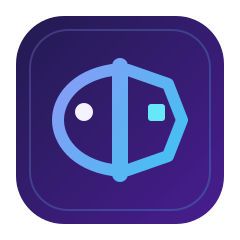
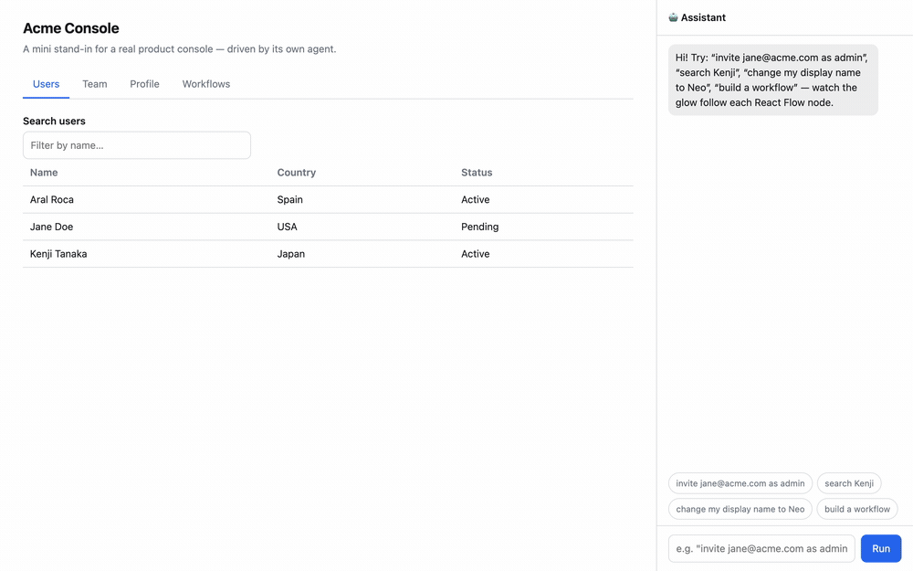

<p align="center">
  <picture>
    <source media="(prefers-color-scheme: dark)" srcset="docs/logo-dark.svg" />
    
  </picture>
</p>

<h1 align="center">Janux</h1>

<p align="center">
  <strong>The fullstack framework for the Agentic Web.</strong><br/>
  One component, two faces: a live view for humans, typed MCP tools &amp; resources for AI agents — generated from the same definition, so they can never drift.
</p>

> [!WARNING]
> Janux is currently **under active development**. This repository is public to enable collaboration and transparency, but it has not been officially announced yet. Expect breaking changes, incomplete documentation, and unfinished features until the first public release.

<p align="center">
  <a href="https://www.npmjs.com/package/janux"></a>
  <a href="https://www.npmjs.com/package/janux"></a>
  
  
  
  
  <a href="./LICENSE"></a>
</p>

<p align="center">
  <a href="https://janux.build"><strong>Website</strong></a> ·
  <a href="https://janux.build/docs/getting-started/what-is-janux">Docs</a> ·
  <a href="https://janux.build/docs/getting-started/quick-start">Quick start</a> ·
  <a href="https://janux.build/docs/getting-started/the-agentic-web">The Agentic Web</a> ·
  <a href="https://janux.build/playground">Playground</a> ·
  <a href="https://github.com/aralroca/Janux/issues/1">RFC 0001</a>
</p>

<p align="center">
  
</p>

<p align="center"><sub><a href="examples/with-web-agent">examples/with-web-agent</a> — the agent calls the same intents a human clicks, and <code>createCopilot({ visualize })</code> is the whole of the feedback: a chip per tool call, a gradient ring on the element being operated, and a backdrop veil that keeps the user's focus on the action.</sub></p>

---

## Why Janux

The web is growing a second audience. People still click, but agents now read, plan and act on the same pages — through MCP clients, through browser agents, through copilots embedded in your own product. **The Agentic Web is the web both of them can operate**, and it is being standardized in the open: MCP for tools over HTTP, WebMCP for tools in the browser, `llms.txt` for discovery, Web Bot Auth for identity.

Today, making an app agent-operable means building it twice. The UI already holds the logic — the validation, the permissions, the business rules — and then a second, hand-written integration re-declares a fraction of it as tools. Two artifacts, one source of truth, and the gap between them grows with every sprint. Tools drift, guardrails are ad-hoc, and nobody can say exactly what an agent is allowed to do.

Janux removes the second artifact. **A component is simultaneously a view, an agent-readable resource and a set of typed tools** — one definition, projected three ways by the framework. A human click and an agent tool call enter the *same* pipeline: guard check → schema validation → `run()` → audit entry. The contract can't rot, because it is generated from the code that renders.

Named after **Janus**, the two-faced Roman god of doorways: one face toward the human, one toward the agent, one threshold. Designed in [RFC 0001](https://github.com/aralroca/Janux/issues/1).

## Table of Contents

- [Install](#install)
- [Quick start](#quick-start)
- [One component, three projections](#one-component-three-projections)
- [Two agent surfaces, zero integration](#two-agent-surfaces-zero-integration)
- [Humans stay in the loop](#humans-stay-in-the-loop)
- [Highlights](#highlights)
- [How it works](#how-it-works)
- [Performance](#performance)
- [Packages](#packages)
- [Documentation](#documentation)
- [Benchmarks](#benchmarks)
- [Templates](#templates)
- [Examples](#examples)
- [Develop](#develop)
- [Contributing](#contributing)
- [Releases](#releases)
- [License](#license)

## Install

```bash
bunx create-janux my-app
cd my-app && bun install && bun run dev
```

Requires [Bun](https://bun.sh) ≥ 1.3 for the dev server and the build. Production is a choice: Bun, [Node 24+](https://janux.build/docs/recipes/deploying) via `@janux/node`, Vercel, or a static export — same app, one adapter.

Or add the pieces to an existing workspace:

```bash
bun add janux @janux/server @janux/agent @janux/cli
```

## Quick start

```tsx
import { component, intent, schema, str, int, money, list } from 'janux';
import { pay } from './pay.api';

//  UI component + 2 WebMCP tools (intents), grouped together for maintainability
export const Cart = component({
  name: 'cart',
  description: 'Shopping cart with line items.',
  state: schema({ items: list({ productId: str(), qty: int().min(1), unitPrice: money() }) }),
  derived: { total: (s) => s.items.reduce((a, i) => a + i.qty * i.unitPrice, 0) },
  intents: {
    addItem: intent({
      description: 'Add a product to the cart',
      input: schema({ productId: str(), qty: int().default(1), unitPrice: money().default(0) }),
      run: ({ state, input }) => state.items.push(input),
    }),
    checkout: intent({ description: 'Pay for the cart', guard: 'confirm', run: ({ state }) => pay({ items: state.items }) }),
  },
  view: ({ state, derived, intents }) => (
    <section>
      <ul>
        {state.items.map((i) => (
          <li key={i.productId}>{i.productId} × {i.qty}</li>
        ))}
      </ul>
      <button onClick={intents.checkout}>Pay ({derived.total}¢)</button>
    </section>
  ),
});
```

You wrote a shopping cart. You also shipped an agent surface — generated, no second file:

```json
{
  "resources": ["ui://cart"],
  "tools": [
    { "name": "cart.addItem", "description": "Add a product to the cart", "guard": "auto" },
    { "name": "cart.checkout", "description": "Pay for the cart", "guard": "confirm" }
  ]
}
```

## One component, three projections

| Projection | For | What it is |
|---|---|---|
| **View** | humans | server-rendered HTML that resumes on first interaction |
| **Resource** | agents | `ui://cart` — typed JSON state, readable and subscribable |
| **Tools** | both | `cart.addItem` (auto), `cart.checkout` (**confirm** → a human approves) |

They cannot drift: there is one definition, and the framework derives the other two. A human click and an agent tool call run the **exact same pipeline** — guard check → schema validation → `run()` → audit entry.

## Two agent surfaces, zero integration

Every Janux app speaks the Agentic Web's protocols out of the box. You declare no tools twice, and you write no adapters.

| Standard | What Janux does with it |
|---|---|
| **MCP** — tools over HTTP | A real, stateless MCP server at `/_janux/mcp`, generated from your `api()` functions. Dual-era: negotiates `2026-07-28` and `2025-06-18`. |
| **A2A** — agent to agent | A derived `/.well-known/agent-card.json` and a JSON-RPC endpoint at `/_janux/a2a`, over the same pipeline and the same guards as MCP — so an agent that arrives by A2A holds no authority an MCP client would be refused. |
| **WebMCP** — tools in the browser | Every mounted intent is registered with `document.modelContext` the moment its island mounts, so browser agents and the DevTools panel see it. Polyfilled where the API is missing. |
| **`llms.txt`** — discovery | Opt-in site index at `/llms.txt` (dynamic routes expanded via `staticParams`), plus a Markdown projection of every page by appending `.md`. |
| **Web Bot Auth** (RFC 9421) | Signed agent identity, verified per request under an `observe` or `require` policy. |
| **Human approval** | `guard: 'confirm'` reaches MCP clients as `annotations.requiresApproval`, arrives over A2A as `TASK_STATE_INPUT_REQUIRED`, and parks agent calls as Proposals whichever door they came through. |

Pointing Claude, Cursor or any MCP client at your app is a URL, not an integration project:

```bash
claude mcp add --transport http my-app https://your.app/_janux/mcp
```

## Humans stay in the loop

Guards are a language feature, not a convention. Every `intent` and every `api()` declares who may call it:

- **`auto`** — agents call it directly.
- **`confirm`** — a human click runs it; an *agent* call parks as a **Proposal** that a person approves or rejects on the real UI, executing exactly once.
- **`forbidden`** — never exposed as a tool. The agent falls back to the DOM, under the same permissions as a user.

Every invocation records its **origin** (`human` / `agent`) in an audit trail, and `janux verify` fails the build if an agent-reachable tool ships without a description. See `examples/human-in-the-loop` in the table below.

## Highlights

- 🧿 **One definition, three projections.** The mounted tree *is* the MCP tree — UI and agent surface cannot drift.
- 🪶 **0 KB JS static pages.** Components without state compile to plain HTML; a page with no islands ships no `<script>` at all.
- ⚡ **Structural resumability.** State is schema-typed JSON, behavior is named — the client resumes from snapshots with no hydration replay and no closure serialization. Zero component code runs until first interaction (asserted in the test suite).
- 🔌 **`api()` = endpoint + stub + tool.** A server function is at once a validated HTTP endpoint, a ~100-byte typed client stub (SWC transform) and an agent tool.
- 🤖 **Zero-config copilot.** `JANUX_MODEL` or one provider API key (Anthropic, OpenAI, Google or OpenRouter) is all it takes. Every app ships the agent endpoint, the manifest and the gui-agent bridge (`window.janux`).
- 🗺️ **App-wide agent control.** Every turn advertises built-in client tools (`ui_navigate`, `ui_get_view_context`, `ui_read_page`, `ui_click`, `ui_fill`, `ui_wait_settled`) plus the full route map — and `ui_calls` turns resume with their results (act → observe → continue), so navigate-then-act works in one turn.
- ⚛️ **Foreign-UI interop.** `foreign()` mounts React components unchanged — real embedded roots, tracked props, callbacks→intents — surviving SPA navigation.
- 🧘 **Observable quiescence.** `await janux.settled()` — the `sleep(500)` idiom dies here.
- 🧪 **CI for the agent surface.** `janux verify` gates undescribed tools; `janux eval` replays scripted agent tasks — including real human-approval steps — against a live app.

## How it works

```
Browser ── janux core (signals, resume, morph, delegation, window.janux bridge)
   │  HTML + state snapshots │ RPC │ agent turns
Server ── @janux/server (SSR, api(), manifest, proposals)
              └── @janux/agent (model resolution, provider loop: api.* server-side, ui_calls → bridge)
```

- **SSR**: sources load server-side; islands arrive with real content plus a JSON state snapshot.
- **Resume**: `boot()` indexes islands, installs two delegated listeners, and mounts an island **only** on first interaction or agent call — from the snapshot, morphing the SSR DOM in place.
- **Agents**: `GET /_janux/manifest?path=/shop` for discovery; `POST /_janux/api/*` for server tools; `window.janux.call()` for UI tools; `POST /_janux/approve` for proposals.
- **Static export**: `output: "static"` prerenders every page into `dist/client` — deploy docs and marketing sites to any static host, agent face included, no server.

### Configure the copilot model

Zero config — first match wins:

1. `defineAgent({ model: 'anthropic/claude-fable-5' })`
2. `JANUX_MODEL=provider/model`
3. Provider key sniffing: `ANTHROPIC_API_KEY` / `OPENAI_API_KEY` / `GOOGLE_GENERATIVE_AI_API_KEY`
4. Nothing set → the endpoint answers with a setup card; the app never crashes.

## Performance

<p align="center">
  <picture>
    <source media="(prefers-color-scheme: dark)" srcset="docs/lighthouse-100-dark.gif" />
    
  </picture>
</p>

The documentation site is built with Janux ([apps/docs](apps/docs)) and scores 100 across the board — including **Agentic Browsing**, Lighthouse's check for whether an agent can actually read and operate the page. A CI job re-runs the audit on every pull request.

## Packages

| Package | What |
|---|---|
| [`janux`](packages/janux) | Core: schema, signals, reactive state, component runtime, SSR islands, manifest, client resume + bridge, foreign interop, data cache, built-in client tools, glow, simulated agent cursor |
| [`@janux/server`](packages/janux-server) | api() RPC, file-system router (layouts, groups, matchers, middleware), HTTP handlers + uploads, HTML shell, `/_janux/*` endpoints incl. the hosted MCP + `.md` projections, llms.txt, Web Bot Auth |
| [`@janux/agent`](packages/janux-agent) | Model resolution, providers, the tool loop with turn continuation, and the embedded harness: memory (in-memory/Postgres), durable workflows, guardrail processors, rate limiting (in-memory/Redis), attachments, outbound MCP client |
| [`@janux/vite`](packages/janux-vite) | Vite plugin (SWC api stubs, SSR bridge, compile-time binding maps + opt-in per-intent code splitting) |
| [`@janux/cli`](packages/janux-cli) | `janux dev / build / start / verify / eval`, plus the adapter API third-party deploy targets are written against |
| [`@janux/node`](packages/janux-node) · [`@janux/vercel`](packages/janux-vercel) | Deployment adapters: a self-contained `build/` for any Node 24+ host, and a Build Output API directory for Vercel |
| [`create-janux`](packages/create-janux) | Scaffolder |

## Documentation

**[janux.build](https://janux.build)** — 114 pages, ⌘K search, dark mode, and a copilot that answers from the docs themselves.

| Section | Start here |
|---|---|
| **Getting started** | [What is Janux?](apps/docs/content/getting-started/what-is-janux.md) · [Quick start](apps/docs/content/getting-started/quick-start.md) · [The Agentic Web](apps/docs/content/getting-started/the-agentic-web.md) · [Mental model](apps/docs/content/getting-started/mental-model.md) |
| **Guide** | [Components](apps/docs/content/guide/components.md) · [Views and JSX](apps/docs/content/guide/views-and-jsx.md) · [Intents and guards](apps/docs/content/guide/intents-and-guards.md) · [Navigation](apps/docs/content/guide/navigation.md) · [The agent and your copilot](apps/docs/content/guide/agent-and-copilot.md) |
| **Tutorial** | [A task board with two faces](apps/docs/content/tutorial/tasks-app-part-1.md) (3 parts) |
| **Reference** | one page per export: [reactivity](apps/docs/content/reference/signal.md), [client](apps/docs/content/reference/client-state.md), [data cache](apps/docs/content/reference/data-cache-api.md), [agent harness](apps/docs/content/reference/agent-memory.md), [CLI](apps/docs/content/reference/cli.md) |
| **Recipes** | [Testing](apps/docs/content/recipes/testing-components.md) · [Forms](apps/docs/content/recipes/forms.md) · [Optimistic UI](apps/docs/content/recipes/optimistic-ui.md) · [Error handling](apps/docs/content/recipes/error-handling.md) · [Custom server](apps/docs/content/recipes/custom-server.md) · [Docker](apps/docs/content/recipes/docker.md) · [Monorepo](apps/docs/content/recipes/monorepo-setup.md) · [Tailwind](apps/docs/content/styles/tailwind.md) · [Local model copilot](apps/docs/content/recipes/local-model-copilot.md) |
| **More** | [Examples](apps/docs/content/more/examples.md) · [Comparison](apps/docs/content/more/comparison.md) · [Benchmarks](apps/docs/content/more/benchmarks.md) · [FAQ](apps/docs/content/more/faq.md) · [Glossary](apps/docs/content/more/glossary.md) |

Agents read the same docs at `/llms.txt` and any page as Markdown by appending `.md`.

**Every example is verified.** `packages/docs-tests` compiles every snippet, checks it imports only symbols the packages really export, runs the main example of a page and asserts what the prose claims. Three guards fail the build when an export has no reference page, when a page's executable claims aren't executed, or when any documented link stops resolving. **Both backlogs are empty**: every public export is documented, and every page that imports the framework has a test that runs it.

## Benchmarks

19 multi-framework suites — client runtime, hydration, SSR, streaming and
shipped bytes — measuring Janux against react 19, preact, solid 2, svelte 5
and vue-vapor, with correctness gates before any number counts. The harness
is a port of [octane](https://github.com/octanejs/octane)'s benchmarks (MIT,
Dominic Gannaway; `js-framework` fixtures derive from
[krausest](https://github.com/krausest/js-framework-benchmark), Apache-2.0).

| Category | Where Janux stands |
|---|---|
| Resume vs hydration | **0.14× react** — 0.39ms to make the news page interactive (react 2.86); 10.70ms vs 57.62 at 6× throttle |
| Shipped JS | 30.9KB gzip total vs react 62.1 (preact 10.0 · solid 14.1 · svelte 18.4 · vue-vapor 24.1); optional layers (glow, cursor, i18n, query cache) are imports that ship only when used; islands-free pages ship 0KB |
| Fine-grained updates | `<For>` + `class={() => …}`: swap 1.10ms vs react 3.98; reverse 1.95 vs 2.24; rotate 0.51 vs 1.51 |
| Mass DOM work | 10k rows: 68.94ms vs react 136.86; clear 38.40 vs 41.74; 512-field reset 14.74 vs 38.64; 512-field update pass 16.84 vs 45.58 |
| Whole-app suites | parity: lifecycle cycle 49.35ms vs 49.56, store integrations within ±1.4×, suspense recovery within 1.14× |
| Building rows in bulk | behind: create-1000 6.56ms vs react 4.88 (solid 1.90) — a row carries an Owner, a signal and an effect |
| SSR throughput | behind: buffered 0.26ms vs react 0.07; streaming end-to-end at parity (50.86 vs 51.06) |

Across the 19 suites, 88 of 156 janux/react cells are ahead of react and 68 are
behind (2026-08-02 pass; bytes above are the 2026-08-06 measurement) — the full
signed table is in
[`benchmarks/BASELINE-2026-07.md`](benchmarks/BASELINE-2026-07.md).

Full tables, methodology and machine specs:
[docs page](apps/docs/content/more/benchmarks.md) · reproduce with
`bun run bench` from [`benchmarks/`](benchmarks/).

## Templates

An example teaches a feature; a **template starts a product**. Each one is a complete app
with its own README, a one-command deploy, and agent evals that prove its agent surface
works — scaffold one and you have something to ship, not something to read.

```bash
bun create janux my-app --template dashboard
cd my-app && bun install && bun run dev
```

Run `--template` with no name and the gallery lists itself. Every template starts with **no
API key**: the copilot degrades to a setup card plus a no-model demo that drives the page
with real tool calls.

| Template | What you start with |
|---|---|
| [`dashboard`](templates/dashboard) | Incident triage whose copilot really operates the board — it acknowledges and resolves through the same tools the buttons call, and maintenance mode is `confirm`-guarded, so its call becomes a proposal a human approves. |
| [`back-office`](templates/back-office) | A customers CRUD where who is asking changes what happens: routine edits execute, deleting parks in an approvals inbox, and one audit trail records the actor from the invocation origin. |
| [`content-site`](templates/content-site) | Markdown with a typed frontmatter contract, served twice: pages for people, and `llms.txt` + per-page `.md` projections + a typed `search` tool for agents — the same code as the search box. |

Full gallery with screenshots: **[janux.build/docs/more/templates](https://janux.build/docs/more/templates)**.

## Examples

43 runnable apps, each a real Janux project — `bun run --cwd examples/<name> dev`.

### Start here

| Example | What it shows |
|---|---|
| [`shop`](examples/shop) | The full picture: catalog source, debounced persist effect, `confirm` checkout with human approval, copilot included. |
| [`hacker-news`](examples/hacker-news) | The canonical clone: streaming suspense front page, `[page=integer]` pagination, a server-rendered nested comment tree, `useQuery` refresh and hover prefetch. |

### The agentic surface

| Example | What it shows |
|---|---|
| [`with-web-agent`](examples/with-web-agent) | The demo above: a console operated in natural language, `createCopilot({ visualize })` for the chips/ring/veil, `glowTarget` for React Flow nodes that mount late, and a `forbidden` intent that forces the DOM fallback. |
| [`human-in-the-loop`](examples/human-in-the-loop) | Who invokes changes what happens: the same `confirm` intent executes on a human click but parks as a Proposal for an agent, with an approvals inbox and an origin-labeled audit trail. |
| [`with-mcp-url`](examples/with-mcp-url) | The app as a bearer-protected MCP server by URL, with a committed tool contract (`agent-contract.json`) that turns CI red if the agent surface drifts. |
| [`with-mcp-client`](examples/with-mcp-client) | The outbound direction: the app's agent connects to an external MCP server by URL, filters the remote tools and re-exposes them on its own surface. |
| [`a2a-supplier`](examples/a2a-supplier) | The app as an agent for other agents: a derived `/.well-known/agent-card.json`, an A2A endpoint beside the MCP one, and a `confirm` guard that parks a remote agent's call for a human here. |
| [`a2a-buyer`](examples/a2a-buyer) | The other side: discovers the supplier by its agent card and hires it over A2A, then follows the task while a human at the supplier decides. |
| [`durable-agent`](examples/durable-agent) | The harness in production shape: Postgres conversation memory that survives restarts, Redis rate limiting, injection guardrails, a durable two-step workflow, and a schedule that triggers it and resumes the same run after the process is killed. |
| [`with-subagents`](examples/with-subagents) | Agent composition: a front desk that delegates lookups to a budgeted `research` subagent (own prompt, intersected tools — never wider than the parent's) and hands money conversations off to a `billing` agent that answers from then on. |
| [`with-local-llm`](examples/with-local-llm) | The copilot's model runs in the browser over WebGPU (`localLlm()`), with `supportsLocalLlm()` detection, a `serverLlm()` fallback and a live local↔cloud swap. |
| [`agent-evals`](examples/agent-evals) | `janux eval` as a CI gate: scripted, model-free agent tasks replayed over the real webMCP surface, including a human approval step — plus a broken eval that proves the gate can fail. |
| [`with-skills`](examples/with-skills) | Skills: a multi-step returns procedure shipped as markdown the model loads on demand, projected to MCP — and `janux verify` failing on a skill that names a tool the app does not have. |
| [`with-channels`](examples/with-channels) | Channels: the same on-call agent answering in the browser and over an HTTP webhook — same `confirm` guard on both doors, and a browser-only intent the model is told it does not have. |

### Components & state

| Example | What it shows |
|---|---|
| [`nested-islands`](examples/nested-islands) | Stateful islands inside stateful islands, with dispose semantics. |
| [`cross-island-state`](examples/cross-island-state) | A `store()` cart shared by five islands with no prop drilling, `persist: 'local'` across reloads, a bus event that crosses islands, and `batch()`ed bundle adds. |
| [`with-forms`](examples/with-forms) | One `schema()` as the contract for three surfaces: the form UI (per-field errors, no reload), the `api()` endpoint, and the typed agent tool. |
| [`with-optimistic-ui`](examples/with-optimistic-ui) | `mutation()` with optimistic writes and real rollback: the server rejects every third save and `onError` restores the snapshot with a visible notice. |
| [`data-cache`](examples/data-cache) | `useQuery` with a reactive query key, typed URL state (`urlState`) that deep-links and honors Back, agent parity for the same filter — plus the HTTP cache model: a public `/catalog` a CDN may keep, a private `/account`, and revalidation by tag readable in the headers. |

### React interop

One example per **category**, each verified in CI — the [compatibility matrix](apps/docs/content/more/interop-matrix.md) states what works, what works with caveats, and what does not.

| Example | What it shows |
|---|---|
| [`interop-react`](examples/interop-react) | A React component (unchanged) mounted with `foreign()`: tracked props, callbacks→intents. |
| [`interop-data-grid`](examples/interop-data-grid) | `@tanstack/react-table` fully controlled from island state, with its **updater-function** callbacks mapped onto intents — the case `on: { prop: 'intent' }` cannot express. |
| [`interop-virtual-list`](examples/interop-virtual-list) | `@tanstack/react-virtual` over 10,000 rows, server-rendered as a real first window, and `scrollToRow` reaching a row no DOM-scraping agent could click. |
| [`interop-charts`](examples/interop-charts) | `recharts`, whose `onClick(data, **index**, event)` payload is the second argument — and an e2e that asserts what Recharts does *not* server-render. |
| [`interop-drag-drop`](examples/interop-drag-drop) | `@dnd-kit` with its a11y wiring server-rendered, and an **unserializable** drag event mapped onto `move { id, toIndex }` — the tool an agent calls to reorder without dragging. |
| [`interop-graph-editor`](examples/interop-graph-editor) | `@xyflow/react` driven both ways: a node drag and a drawn edge become `moveNode` / `connect`. `hydrate: 'only'`, because React Flow measures its viewport on mount. |
| [`interop-forms`](examples/interop-forms) | The honest caveat: `react-hook-form` + `zod` own the inputs, so an agent's `fill` has to be reconciled into them explicitly. |
| [`interop-command-palette`](examples/interop-command-palette) | `cmdk`, with an e2e assertion that the rendered command ids and `palette.run`'s enum are the same list. |
| [`interop-a11y-primitives`](examples/interop-a11y-primitives) | `@radix-ui/react-dialog` with its focus trap and scroll lock intact, portalling out of the foreign host — and a navigation with the dialog open that neither throws nor leaves `<body>` unscrollable. |

### Rendering & routing

| Example | What it shows |
|---|---|
| [`with-suspense`](examples/with-suspense) | Streaming SSR: independent `suspense` boundaries that reveal mid-stream, and `error` boundaries that bubble. |
| [`with-advanced-routing`](examples/with-advanced-routing) | The full router grammar: `[slug]`, `[...path]`, `[[...rest]]`, `[id=integer]`/`[uid=uuid]` matchers, nested `_layout.tsx` chains, `(marketing)` groups and the `_404.tsx`/`_500.tsx` pages, plus SPA navigation with a `persist` island. |
| [`blog-static`](examples/blog-static) | A markdown blog exported with `output: 'static'` + `staticParams`: zero-JS pages, speculation rules, and the agent face (`llms.txt`, sitemap, `.md` projections) from the same build. |
| [`with-content`](examples/with-content) | Typed content collections: frontmatter validated by the same `schema()` as component state, and MDX notes that embed a real Janux island and a React component via `foreign()` — compiled on the server, so a note of prose still ships 0 KB. |
| [`with-images`](examples/with-images) | Both halves of CLS: one `<Image>` renders AVIF/WebP candidates written by `janux build`, and a declared font is self-hosted, subset, preloaded and given a metric-adjusted fallback — CLS 0 with `output: 'static'` and 0 KB of JS. |
| [`i18n`](examples/i18n) | Internationalization: locale-prefixed routing, language switcher, type-safe `t()` with plurals, and page-scoped client translations. |

### Styling

| Example | What it shows |
|---|---|
| [`with-tailwind`](examples/with-tailwind) | `@janux/tailwind` zero-config: a pricing page with dark mode and a stateful billing toggle, styled only with v4 utilities. |
| [`with-sass`](examples/with-sass) | Sass with no config beyond the file extension: tokens, nesting, a mixin and four accent classes generated by one `@each` loop, compiled to a single `/styles.css`. |
| [`with-css-variables`](examples/with-css-variables) | Runtime theming: island state writes `--brand`/`--pad`/`--radius` onto one wrapper and the cascade rethemes the page, with no rebuild and no extra stylesheet. |

### Server & data

| Example | What it shows |
|---|---|
| [`with-sqlite`](examples/with-sqlite) | Real persistence with `bun:sqlite` and both server surfaces on one database: `api()` RPC (delete is `confirm`-guarded — agents propose, humans approve) next to classic REST handlers. |
| [`with-uploads`](examples/with-uploads) | End-to-end file uploads: `dropzone()` feeding a validating multipart handler (type + size), server-rendered gallery, previews without a reload. |
| [`realtime-chat`](examples/realtime-chat) | A custom server composing `createJanuxServer` with Bun's native WebSockets: optimistic delivery, cursor-based replay on reconnect, live presence. |
| [`with-offline`](examples/with-offline) | Service worker, offline and PWA: `src/sw.ts` plus `offlineFirst()`, a prerendered site that opens with no network, an offline fallback for pages never visited, and a deploy that takes over without stranding an open tab. |
| [`with-worker`](examples/with-worker) | `worker()`: the same prime-counting function on a Web Worker and on the main thread, with a ticker that proves which one froze the page. |
| [`with-node-adapter`](examples/with-node-adapter) | The same app deployed to Node with `@janux/node`: one `build/` directory, no Bun on the box, and a click counter that only moves if the island hydrated from the bundle Node served. |

## Develop

```bash
bun install
bun test             # the whole suite: schema, signals, runtime, SSR, resume, morph, interop, router, cache, guards, agent loop, harness, SWC stubs
bun run test:census  # per-area counts, the coverage floor, and the count the docs claim
bun run typecheck
```

## Contributing

PRs welcome — see [CONTRIBUTING.md](CONTRIBUTING.md) and our [Code of Conduct](CODE_OF_CONDUCT.md). Third-party work Janux builds on is credited in [CREDITS.md](CREDITS.md); security reports go through [SECURITY.md](SECURITY.md).

## Releases

Janux is 0.x, and every published package moves on one version.

- [CHANGELOG.md](CHANGELOG.md) — what changed, newest first.
- [VERSIONING.md](VERSIONING.md) — what a minor is allowed to break, how much notice you get, and how long each one is supported.
- [STABILITY.md](STABILITY.md) — every public export marked stable, experimental or internal. Generated from the exports themselves.

## License

[MIT](LICENSE) © [Aral Roca](https://aralroca.com)
